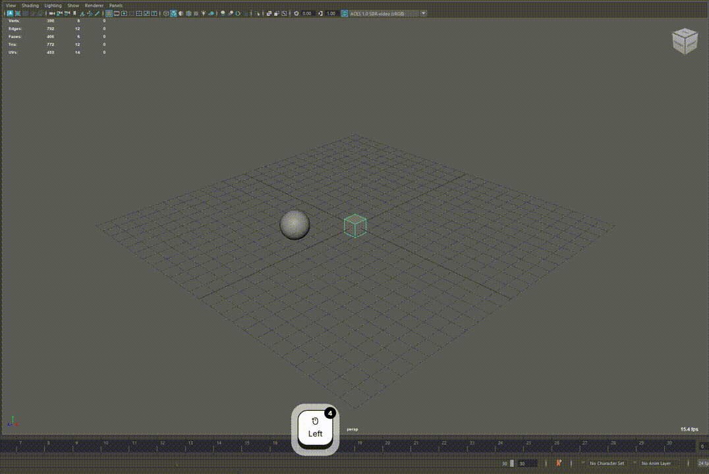
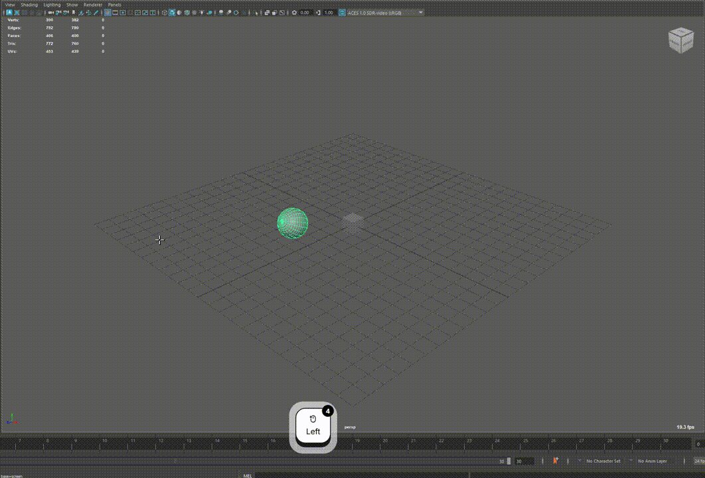
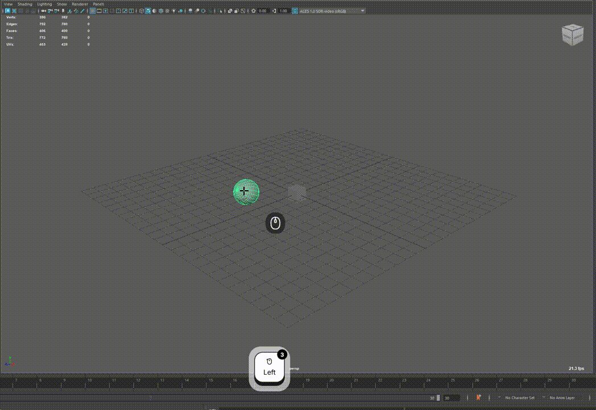

I've started a new side project called **VAM** — short for **Vim for Animator**. It's a Maya plugin that brings the modal, keyboard-first workflow of Vim (and a bit of Blender) into rig and animation work.

## Why build this?

Maya's default transform tools work, but they lean heavily on the mouse — gizmo clicks, menu hunting, and repetitive selection. When you're jumping between translate, rotate, and scale, or re-selecting the same controls frame after frame, the overhead adds up. I wanted a workflow where both hands pull their weight: the mouse stays in the viewport for manipulation, while the keyboard handles mode switches, constraints, and selection — two hands collaborating, rather than one doing all the work.

## What it does

VAM adds a custom Maya viewport tool with its own hotkey context. Activate it, and you're working in an isolated environment where keyboard shortcuts drive most of the action. Press `Esc` to drop back to Maya's normal select tool.

### Modal transforms

Instead of grabbing a gizmo and hoping you picked the right axis, you enter explicit modes:

- **Translate** — `w`
- **Rotate** — `e`
- **Scale** — `r`

Once a transform mode is active, VAM enters a modal state — similar to Blender. Move the mouse to adjust the value; number keys cycle axis and coordinate-space constraints. Confirm with a click, or press `q` to cancel. The camera stays locked during a modal session so your framing doesn't drift while you edit.

### Vim-style registers

This is the part I'm most excited about. Registers let you stash object selections under single-letter keys, similar to Vim's `"a` / `"b` buffers:

- **Assign** — `Ctrl+R`, then a letter, saves the current selection
- **Recall (replace)** — `Ctrl+T`, then a letter
- **Recall (add)** — `Ctrl+Shift+T`
- **Recall (remove)** — `Ctrl+Alt+T`

If you animate the same set of FK controls every few frames, this saves a lot of repetitive clicking.

### Copy / paste transforms

Copy world-space transform values from one object and paste them onto others:

- **Copy** — `Ctrl+C`, then `w`, `e`, `r`, or `a` for translate, rotate, scale, or all channels
- **Paste** — `Ctrl+V` onto the current selection

Handy for matching poses or snapping offsets without digging through the channel box.

## How it's built

Under the hood, VAM is a standard Maya `MPxContext` plugin paired with a Python state machine. Viewport events (mouse press, drag, release) go through the context; keyboard events route through Maya's hotkey system in a dedicated hotkey context tied to the tool. That split keeps performance-sensitive input on the native side while state logic and bindings stay easy to tweak in Python.

Key bindings live in `configs/default_profile.json` and can be remapped without touching code.

## Early days

VAM is still in early development — APIs, bindings, and behavior will change. But the core ideas are in place: modal transforms, registers, and copy/paste transforms, all behind a single viewport tool.

More to come as I flesh out visual feedback, animation-curve tooling, and the rest of the register workflow. If you're curious, the project lives at [github.com/joeyskeys/vam](https://github.com/joeyskeys/vam) — though fair warning, it's very much a work in progress.
